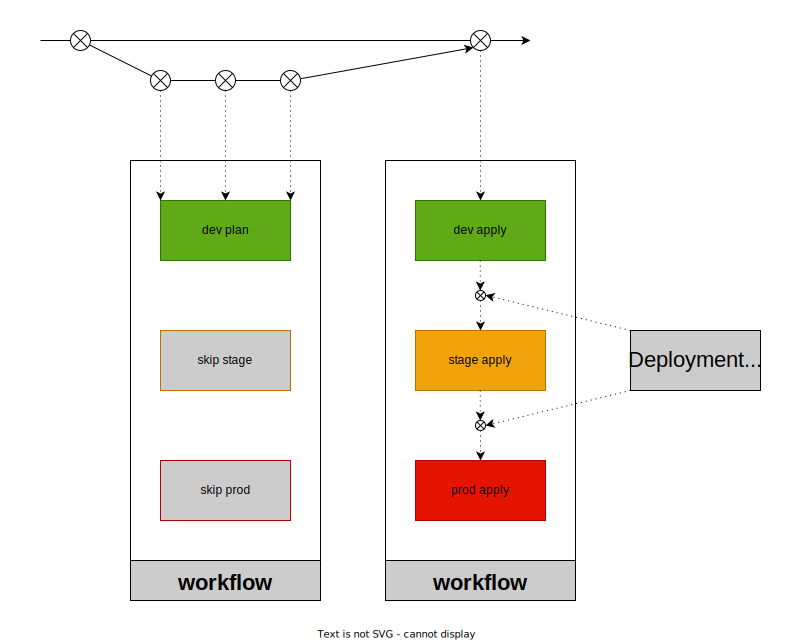

# poc-digger-shared

This repo is a GitOps process POC using Github Actions, Github Environments and [Digger](https://github.com/diggerhq/digger). Note that Environment protection rules are used, which requires a public git repository or the Github Enterprise subscription plan.

_Illustrating the process pipeline_
